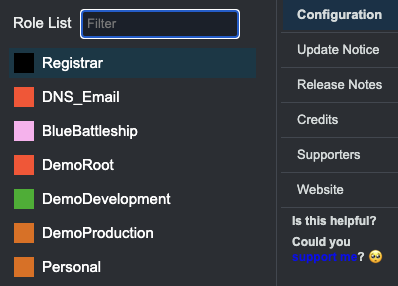

## Introduction

Welcome! This is the start of a series of posts where I am going to document (and probably update) my personal AWS setup. I spun up my first Amazon EC2 instance back in 2010, and, since then, grown my setup to use 8 different AWS accounts, mostly automated with Terraform. This series will cover all choices & tradeoffs I made, and also document the Terraform code I use to set it all up. So grab a beverage of your choice while I turn coffee into code.

## Series

Below is the list of content pieces of the series that I *think* I will end up needing to cover it all, but it will likely change over time. I'll add an updates section at the bottom of this one to cover any decision / plan changes as we go along. Here's what I think it will look like:

1. Multiple AWS accounts - why you would need them, how to use and set up AWS IAM access between them, and the Terraform code to create and manage them.
2. CI/CD pipeline for Terraform - I try to manage everything possible with Terraform, so I usually need to set up a CI/CD pipeline as one of the first steps. This will include accessing the different accounts
3. Securing an AWS account - the steps I take for any new AWS account I set up, IAM roles to access it, and then any billing / monitoring I add.
4. Managing my DNS - I have too many domains, and spent a chunk of time to move them all to AWS in Route53 so I can centrally manage the yearly renewals, SOA entries, and also then automate the Route53 Zones I use for my DNS records.
5. Figure out email - Since I have so many domains, I haven't spent enough time setting up and managing my email for them. Used to have Google Apps accounts for each when it was still free, but since that fell away, I haven't set up a solution.

## High-level overview

So why would you need multiple AWS accounts you ask? Well, I like playing and learning with different AWS services, but I also have some systems / applications running that I don't want to break. If you've ever used [AWS Nuke](https://github.com/rebuy-de/aws-nuke), you probably know the stress right after you press enter to have it tear down everything. Using AWS Organizations, it is easy to create and access additional accounts.

I split my accounts for security and purpose, so I have the following set up currently:

```text
├── billing
└── root (node)
    ├── blue-battleship
    ├── demo (node)
    │   ├── dev
    │   ├── main
    │   └── prod
    ├── dns (node)
    │   ├── name-servers
    │   └── registrar
    └── personal
```

This a text representation of my AWS Organizations setup, with the lines marked with `(node)` being logical groups, not accounts. I'll cover what each is for, why, and how I set them up in the first post of this series.

## Managing access

You may be wondering if it isn't a nightmare to access so many different AWS accounts. For my day-to-day, it is fairly simple, I have a single IAM user in the `demo-main` account that I log in with, and then switch roles into each of the other accounts. I use the [AWS Extend Switch Roles](https://chromewebstore.google.com/detail/aws-extend-switch-roles/jpmkfafbacpgapdghgdpembnojdlgkdl) Chrome extension. You can use the drop-down at the top-right in the AWS Console once you are logged in as well, but as it uses cookies on your local machine, it will not persist the configuration for you. I started with it, but as I started working on both my desktop at home, and my laptop while I was at clients while consulting, it became too much work to keep it updated. I tried storing a text file with the details in my cloud document solution, but even with that, it would take me about 5 - 10mins to set it up again if I needed to. Then I discovered the AWS Extend Switch Roles extension a few years back, and have been using it since. The short version is that you have a configuration you add, and this is sync'ed if you are signed into Chrome. I also keep a text copy of this in 1Password just in case something goes wrong. To configure it, you provide the different accounts, and how to access them, here is my setup:

```text
[profile Registrar]
role_arn = arn:aws:iam::111111111111:role/administrator
color = 000000

[profile DNS_Email]
role_arn = arn:aws:iam::222222222222:role/administrator
color = FF3232

[profile BlueBattleship]
role_arn = arn:aws:iam::333333333333:role/administrator
color = ffaaee

[profile DemoRoot]
role_arn = arn:aws:iam::444444444444:role/administrator
color = FF3232

[profile DemoDevelopment]
role_arn = arn:aws:iam::5555555555555:role/administrator
color = 23B223

[profile DemoProduction]
role_arn = arn:aws:iam::666666666666:role/administrator
color = E46317

[profile Personal]
role_arn = arn:aws:iam::777777777777:role/administrator
color = E46317
```

When I click on the extension, I see the following if I'm logged into my AWS account:



Switching into any of the child accounts is now simply a single click after I've logged in. This doesn't mean that I don't have the root user credentials for each account though, I'll cover that in a short post later - after I moved to Seattle at the end of 2021, I had to update the billing information for each one. This took quite a bit of time as I only did the cleanup in April 2024, and my South African phone number had issues, so I couldn't do phone verification.

## So, what do I run in my accounts

My main use-case is for domain registration, DNS, and testing out ideas. In the past, I used Amazon EC2 Anywhere to manage containers running on my home server, but broke it when I migrated to Proxmox and moving my containers to a dedicated VM. I have been working on moving my blog to Amplify instead of GitHub Pages, but that is still a work in progress. Once I have the current setup documented here, I will be working through a list of use-cases I've come across over the years.

And that's it for now, wanted to keep this nice and short so I can start on doing the actual work of each piece.

## Content pieces in the series

I'll update the list below as I publish the pieces to make them easier to find. Also have a look at [`/aws-services`](/aws-services/) if you are interested to see examples of using AWS services.

1. Nothing to see here yet
