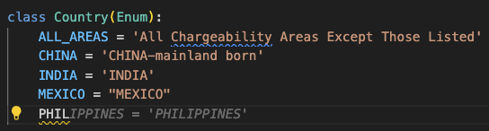
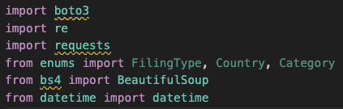
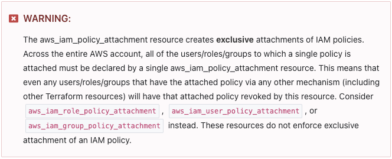
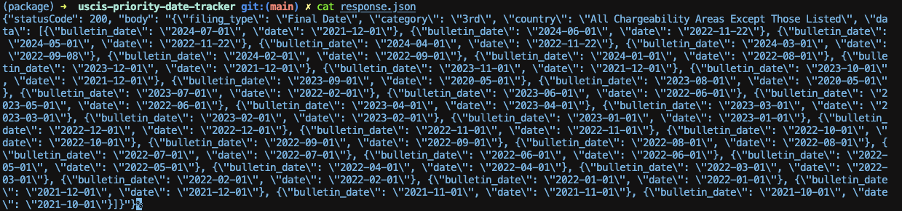

## Introduction

In the previous articles, I built a serverless API that scrapes the data from the USCIS monthly visa bulletins, and stores them in an Amazon DynamoDB table. After jumping in and [defining the whole infrastructure with Terraform](()), [I realised that I should probably first ensure the code is working](()). Now it is time to add some parameters to our function so that it will return the data from categories other than the hard-coded EB-3 one, with some help from [Amazon Q Developer](https://aws.amazon.com/developer/generative-ai/amazon-q/?trk=01b23196-71a4-403b-909c-65ddc571caa0&sc_channel=el) :)

## Updating the Scrape and Storage Logic

Before we get to that though, we need to update the logic around the lookups and storing the data. Currently, it will loop over all the URLs on the [main page](https://travel.state.gov/content/travel/en/legal/visa-law0/visa-bulletin.html), extract the ones that contain `/visa-bulletin-for-`, and then do a lookup in the DynamoDB table `ProcessedURLS` to see if that URL was processed. Only the data from pages that are not in that database table will be scraped, added to a single collection, then that whole collection will be stored. We need to update the code so that it stores the data as it scrapes a URL, and before writing the processed entry - if there was an error, it currently will not reprocess that page.

## Fixing Up Processing and Storing Our Data

To get started, [let's see what we need to change](#prompt-1). Ok, only a small change is needed to `lambda_handler` for the loop where we process and store the data, updated version is now:

```python
    # Scrape data from each visa bulletin page
    for link in visa_bulletin_links:
        if '2022' in link or '2023' in link or '2024' in link:
            # Check if the URL has been processed
            response = processed_urls_table.get_item(Key={'url': link})
            if 'Item' in response:
                print(f"Skipping URL: {link} (already processed)")
                continue

            # Process the URL
            print(f"Processing URL: {link}")
            url = f"https://travel.state.gov{link}"
            url_data = scrape_visa_bulletin(url)
            data.extend(scrape_visa_bulletin(url_data))

            # Store the data
            store_data(url_data)

            # Store the processed URL in DynamoDB
            processed_urls_table.put_item(Item={'url': link})
```

Surprisingly little effort, so not much of a distraction.

## Defining Some Enums

Looking at the existing parameters (with current defaults), I suspect an `enum` would work, but I don't know how this is done in Python:

```python
def read_data_locally(data, filing_type = 'Final Date', category = '3rd', country = 'All Chargeability Areas Except Those Listed'):
```

The [response looks to be what I need (minus the incorrect country, plus the missing ones)](#prompt-2), so let's add some enums!

```python
from enum import Enum

class FilingType(Enum):
    FINAL_DATE = 'Final Date'
    DATES_FOR_FILING = 'Dates for Filing'

class Category(Enum):
    FIRST = '1st'
    SECOND = '2nd' 
    THIRD = '3rd'
    FOURTH = '4th'
    OTHER_WORKERS = 'Other Workers'

class Country(Enum):
    ALL_AREAS = 'All Chargeability Areas Except Those Listed'
    CHINA = 'CHINA-mainland born'
    INDIA = 'INDIA'
    MEXICO = "MEXICO"
    PHILIPPINES = 'PHILIPPINES'
```

**Side-note:** Interesting how [Amazon Q](https://aws.amazon.com/q/?trk=07910bf4-f673-4ded-8aa5-ce30fb5e3fdc&sc_channel=el) autocompleted `PHILIPPINES` for me, I'm assuming it picked it up from the context of the linked URLs - I did a reboot of my laptop this morning and started a new chat, so don't think it would be previous chat context, but could be mistaken:



Running the app now doesn't return any data, so I suspect that [I need to reference the enums differently](#prompt-3), and yup, I do. Just append `.value`.

## Adding Parameters

Now we need to change the code so we can pass these values in. Currently, I'm running the code locally via `python3 local_test.py` which calls the `handler.py` code via:

```python
mock_context = MockContext()

mock_event = {
    "key1": "value1",
    "key2": "value2",
    # Add any other relevant data for your event
}

result = lambda_handler(mock_event, mock_context)
```

Hrm, this could be interesting, how would I pass the enum as a request? I could use integers, and do some kind of mapping between the number and the enum value, but honestly, I'm not sure how this works in Python. [Time to find out though!](#prompt-4) The first part of how I add them to the `event` seems reasonable:

```python
mock_event = {
    'queryStringParameters': {
        'filing_type': 'FINAL_DATE',
        'category': 'THIRD',
        'country': 'ALL_AREAS'
    }
}
```

I'm not quite sure that the way of extracting them looks right, adding in the 2nd parameter looks like hardcoding it to me:

```python
    query_params = event.get('queryStringParameters', {})
    filing_type_str = query_params.get('filing_type', 'FINAL_DATE')
    country_str = query_params.get('country', 'ALL_AREAS')
    category_str = query_params.get('category', 'THIRD')
```

[After clarifying how the `get()` method works](#prompt-5), this does appear to be the correct way - that 2nd parameter is a default if it doesn't find the value in the input. Having it as a string bugs me - if I ever change the name of the enum, this will not work. After a bit of back and forth ([1](#prompt-6), [2](#prompt-7), [3](#prompt-8)) I had the following:

```python
    query_params = event.get('queryStringParameters', {})
    filing_type_str = query_params.get('filing_type', FilingType.FINAL_DATE.name)
    country_str = query_params.get('country', Country.ALL_AREAS)
    category_str = query_params.get('category', Category.THIRD.name)

    # Convert string values to enum members
    filing_type = FilingType[filing_type_str.upper()]
    country = Country[country_str.upper()]
    category = Category[category_str.upper()]

    ...
    # Updated call to read_data() with the parameters

    eb3_data = read_data(filing_type, category, country)
```

Additionally, I removed the hardcoded defaults on `read_data()` and `read_data_locally()`. Running the code locally returns the data as expected, I also checked with `'category': 'SECOND',` just to make sure.

## Splitting the Scrape and Retrieve Methods

We are now at a point where the code does what we want, except that every time we retrieve data, it would also loop through all the bulletins and try to process them. Ideally this should be split into 2 separate functions, with a way to call the code to scrape any new bulletins one a schedule. Before I try to find the answer, I'm thinking I could create a 2nd functions similar to `lambda_handler(event, context)`, and then set up a 2nd Lambda function using the same Lambda layer for the `requirements`. It does mean I will include some libraries not needed by each function as it will contain **all** the ones across both functions, but I'm fine with that approach. Splitting this into 2 different projects, or even just splitting the `requirements.txt` file feels like even more over the top than we are already are.


The [suggested approach](#prompt-9) is to split the project into 2 files, `scraper.py` and `retriever.py`, and then to have a `lambda_handler` function in each. I'm tempted to just create a 2nd function inside the 1 file, but let's go with the suggestion and split it into those 2 files. After I rename `handler.py` to `scraper.py` and create a copy named `retriever.py`, I realise we will need to split it further. At the top of the code, we set the tables via `table = dynamodb.Table('VisaBulletinData')` and `processed_urls_table = dynamodb.Table('ProcessedURLs')`, and we also have the enums defined as classes, and both of the functions need them. I [look how I would do that](#prompt-10), and merrily follow the suggestion.

After I remove the code not needed in each of the new functions, each in their own file, extract the enums into `enums.py`, and add the import statement, I stare at the import line in `scraper.py` for a few seconds:



Why are the 3 classes I import the darker colour of an unused import? Aaaaah! While I use the enums to retrieve the data, I never use them to store the data. I suddenly realise that I should probably change the code to use them as a mapping from the text in the bulletins. I noticed in some of the older ones that the 5th category was split less granularly, so we would need to address that as well.

## Taking a Step Back

I've been building this app over the last 2 - 3 weeks spending an hour here and there between other work to build it out. Initially I intended to sit down and build it out in a day or 2, and expected it to not take any longer. I started out with the intention that I wanted to use a Lambda function, store the data in DynamoDB, and then be able to query it. Putting on my Captain Obvious cape, I realise that this is a lot of additional complexity for a problem I could have solved with a spreadsheet where I paste in a new row or two once a month. As the saying goes:

> If all you have is a hammer, then all your problems look like a nail.

Ok, new plan. I'm going to continue down this path for only a short while longer till I have the Lambda functions deployed, and I can call them.

## Updating the Infrastructure

Since we now have 2 separate functions, we also need to deploy them. This requires changing the existing Lambda since it referenced `handler.py`. Pasting all the Terraform resources again would take up quite a bit of space, but you can look at the [current version](https://github.com/build-on-aws/uscis-priority-date-tracker/blob/article-2/app.tf#L30-L150) at this point in time. We can keep the following resources as-is:

1. `resource "null_resource" "pip_install"` - we aren't splitting `requirements.txt` per source file, so a single one stays the same.
2. `data "archive_file" "layer"` - used to trigger updating the Lambda layer we create for our dependencies.
3. `resource "aws_lambda_layer_version" "layer"` - creates the Lambda layer.
4. `data "archive_file" "app"` combined with the line `source_code_hash = data.archive_file.app.output_base64sha256` to ensure we update the functions for any code changes. This will trigger for both functions even if we only update one of them, but I don't feel it is worth the effort for this project.

I do want to ensure we provide the least amount of IAM permissions per function, so will duplicate the existing IAM role, policy, and attachments, and then reduce the scope of each IAM policy for each function with only the access needed. The last step will be to define a 2nd Lambda function after updating the existing one to use the renamed source file. Sorry, I lied, the last-last step will also be to update the DynamoDB table names to use the environment variables defined in the Lambda function, with a fallback if they are not set.

### Adding the Environment Variables for DynamoDB Table Names

This change requires updating the Terraform resource for our Lambda function, below is the updated `scraper.py` function:

```hcl
# Define the Lambda function
resource "aws_lambda_function" "visa_bulletin_scraper" {
  function_name    = "visa-bulletin-scraper"
  handler          = "scraper.lambda_handler" # <--- I've updated the handler's filename as well
  runtime          = "python3.12"
  filename         = data.archive_file.app.output_path
  source_code_hash = data.archive_file.app.output_base64sha256
  role             = aws_iam_role.lambda_role.arn
  layers           = [aws_lambda_layer_version.layer.arn]

  environment {
    variables = {
      BULLETIN_DATA = aws_dynamodb_table.visa_bulletin_data.name,
      PROCESSED_BULLETIN_URLS = aws_dynamodb_table.processed_urls.name
    }
  }
}
```

We also need to change the currently hard-coded table names at the top of `scraper.py` to the following to [use the environment variables, with a fallback value](#prompt-11):

```python
import os # <--- new import added

...

# Initialize DynamoDB client
dynamodb = boto3.resource('dynamodb')

table_name = os.environ.get('BULLETIN_DATA', 'VisaBulletinData')
table = dynamodb.Table(table_name)

processed_urls_table_name = os.environ.get('PROCESSED_BULLETIN_URLS', 'ProcessedURLs')
processed_urls_table = dynamodb.Table(processed_urls_table_name)
```

For `retriever.py`, we only need to add the `VisaBulletinData` via `BULLETIN_DATA`.

### Create a 2nd Lambda Function

As mentioned above, we will reuse the same Lambda layer, and only create a 2nd function for `retriever.py`, along with its own IAM policy and role. While doing this, I notice that past-Cobus was lazy with the  resource names:

```hcl
resource "aws_iam_role" "lambda_role" {
  name = "visa-bulletin-scraper-role"

  ...

}

# Attach the necessary IAM policies to the role
resource "aws_iam_policy_attachment" "lambda_basic_execution" {
    name = "lambda_basic_execution"
  policy_arn = "arn:aws:iam::aws:policy/service-role/AWSLambdaBasicExecutionRole"
  roles      = [aws_iam_role.lambda_role.name]
}

resource "aws_iam_policy_attachment" "dynamodb_access" {
    name = "dynamodb_access"
  policy_arn = aws_iam_policy.dynamodb_access_policy.arn
  roles      = [aws_iam_role.lambda_role.name]
}

# Define the IAM policy for DynamoDB access
resource "aws_iam_policy" "dynamodb_access_policy" {
...
}
```

We now need to duplicate the Lambda function resource, along with reduced permissions for the IAM role needed by `retriever.py`. It is also a good time to split out our Terraform resources into smaller files to make it easier to find each one of them. I decided to split them from the single `app.tf` into the following:

1. `dynamodb.tf` - defines the 2 tables we use.
2. `lambda_layer.tf` - builds and creates the Lambda layer used by both functions.
3. `lambda_zip.tf` - zips up all the application code into a single `.zip` used by both functions.
4. `lambda_scraper.tf` - defines the Lambda function, IAM policy, and IAM role for `scraper.py`.
5. `lambda_retriever.tf` - defines the Lambda function, IAM policy, and IAM role for `retriever.py`.

After making these changes, and running `terraform apply`, the following error is returned:

```text
│ Error: creating IAM Role (visa-bulletin-scraper-role): operation error IAM: CreateRole, https response error StatusCode: 409, RequestID: 94248aee-5615-4fbf-936e-81ceb9c24f0f, EntityAlreadyExists: Role with name visa-bulletin-scraper-role already exists.
│ 
│   with aws_iam_role.scraper_role,
│   on lambda_scraper.tf line 20, in resource "aws_iam_role" "scraper_role":
│   20: resource "aws_iam_role" "scraper_role" {
│ 
╵
╷
│ Error: creating IAM Policy (visa-bulletin-scraper-dynamodb-access): operation error IAM: CreatePolicy, https response error StatusCode: 409, RequestID: da27e143-5a7e-4008-81a8-49bf23fb99d8, EntityAlreadyExists: A policy called visa-bulletin-scraper-dynamodb-access already exists. Duplicate names are not allowed.
│ 
│   with aws_iam_policy.scraper_dynamodb_access_policy,
│   on lambda_scraper.tf line 53, in resource "aws_iam_policy" "scraper_dynamodb_access_policy":
│   53: resource "aws_iam_policy" "scraper_dynamodb_access_policy" {
│ 
╵
```

Since I renamed the `aws_iam_role` resource from `lambda_role` to `scraper_role`, we ran into a race condition where the delete for the old one didn't complete before the new one's create started. [IAM role names need to be unique](https://docs.aws.amazon.com/IAM/latest/UserGuide/reference_identifiers.html), and this is why we encountered this issue. Running `terraform apply` a second time will fix this - worth keeping in mind if you ever run into this after doing a cleanup.

```text
Apply complete! Resources: 4 added, 1 changed, 0 destroyed.
```

**Pro-tip:** `terraform fmt` will format your `.tf` files in the current directory and fix the indentation, be kind and ~rewind~ clean up your source files before you commit them (unlike past-Cobus who also forgot that step).

### But Does It Work

> _If you deploy a Lambda function, but you never call it, does it even exist?_

In theory, we now have our 2 Lambda functions that would scrape or return the data. We haven't called them yet though, so [let's see how we can call them from our terminal](#prompt-12):

```bash
aws lambda invoke \
  --function-name visa-bulletin-retriever \
  --cli-binary-format raw-in-base64-out \
  --payload '{"queryStringParameters": {"filing_type": "FINAL_DATE", "category": "THIRD", "country": "ALL_AREAS"}}' \
  response.json
```

Which returns the lovely error:

```json
{
    "StatusCode": 200,
    "FunctionError": "Unhandled",
    "ExecutedVersion": "$LATEST"
}
```

### No It Does Not

Using the AWS Console to test the `retriever` function with the same payload as above, I see the issue:

!["AWS Console showing the error when running the Lambda function being [ERROR] NameError: name 'Enum' is not defined"](images/lambda_failure.png)

When splitting out the enums into their own source file, I forgot to also add the `import` statement. After fixing that, I run `terraform apply` again, and I'm quite curious to see what the change looks like since we're using Lambda layers. The following change to the IAM role makes me suspicious:

```text
  # aws_iam_policy_attachment.retriever_lambda_basic_execution will be updated in-place
  ~ resource "aws_iam_policy_attachment" "retriever_lambda_basic_execution" {
        id         = "retriever_lambda_basic_execution"
        name       = "retriever_lambda_basic_execution"
      ~ roles      = [
          - "visa-bulletin-scraper-role",
            # (1 unchanged element hidden)
        ]
        # (3 unchanged attributes hidden)
    }

  # aws_iam_policy_attachment.scraper_lambda_basic_execution will be updated in-place
  ~ resource "aws_iam_policy_attachment" "scraper_lambda_basic_execution" {
        id         = "scraper_lambda_basic_execution"
        name       = "scraper_lambda_basic_execution"
      ~ roles      = [
          - "visa-bulletin-retriever-role",
            # (1 unchanged element hidden)
        ]
        # (3 unchanged attributes hidden)
    }
```

This rings a bell from years ago, but I can't quite remember, so off I go and do a search for `aws_iam_policy_attachment` so I can look at the [documentation](https://registry.terraform.io/providers/hashicorp/aws/latest/docs/resources/iam_policy_attachment). Right at the top of the page, it has a big, red warning:



Aha! _🎵 It's all coming back to me nooooow! 🎵_ This was similar to setting the security group rules inside the [`aws_security_group`](https://registry.terraform.io/providers/hashicorp/aws/latest/docs/resources/security_group) - in the case of `aws_iam_policy_attachment`, it will play whack-a-mole since we need to attach that policy to 2 different IAM roles. On the first run, one of them will end up succeeding, but for future runs, it will try to attach it again since whichever one finished last would remove the one that finished first. To fix this, we need to use `aws_iam_role_policy_attachment` instead:

```hcl
resource "aws_iam_role_policy_attachment" "retriever_lambda_basic_execution" {
  role       = aws_iam_role.retriever_role.name
  policy_arn = "arn:aws:iam::aws:policy/service-role/AWSLambdaBasicExecutionRole"
}
```

Updates done, and ran `terraform apply` again, only for it to timeout after 2 minutes with:

```text
╷
│ Error: reading IAM Role Policy Attachment (visa-bulletin-retriever-role:arn:aws:iam::631077426493:policy/visa-bulletin-retriever-dynamodb-access): empty result
│ 
│   with aws_iam_role_policy_attachment.retriever_dynamodb_access,
│   on lambda_retriever.tf line 45, in resource "aws_iam_role_policy_attachment" "retriever_dynamodb_access":
│   45: resource "aws_iam_role_policy_attachment" "retriever_dynamodb_access" {
│ 
╵
╷
│ Error: reading IAM Role Policy Attachment (visa-bulletin-scraper-role:arn:aws:iam::aws:policy/service-role/AWSLambdaBasicExecutionRole): empty result
│ 
│   with aws_iam_role_policy_attachment.scraper_lambda_basic_execution,
│   on lambda_scraper.tf line 40, in resource "aws_iam_role_policy_attachment" "scraper_lambda_basic_execution":
│   40: resource "aws_iam_role_policy_attachment" "scraper_lambda_basic_execution" {
│ 
╵
╷
│ Error: reading IAM Role Policy Attachment (visa-bulletin-scraper-role:arn:aws:iam::631077426493:policy/visa-bulletin-scraper-dynamodb-access): empty result
│ 
│   with aws_iam_role_policy_attachment.scraper_dynamodb_access,
│   on lambda_scraper.tf line 45, in resource "aws_iam_role_policy_attachment" "scraper_dynamodb_access":
│   45: resource "aws_iam_role_policy_attachment" "scraper_dynamodb_access" {
│ 
```

The hint here is the `empty result` - when you try to attach a policy the 2nd time, it will not return an error if it is already attached. So we have another race condition (I think): the request to remove the attachment (since we replaced the `aws_iam_policy_attachment` with `aws_iam_role_policy_attachment`) was was made in parallel to the new one in an order where it didn't return a successful response for the new one. At least this is what I would speculate without digging into it too much. Regardless, you can get around this issue by just running `terraform apply` a 2nd time.

### Let's Try Again

Second time is the charm, right? Running our `aws invoke-lambda` command again returns:

```text
{
    "StatusCode": 200,
    "ExecutedVersion": "$LATEST"
}
(END)
```

And then it will wait for you to exit the output view - this is the standard behaviour, and you can exit it via `ctrl + c` or `cmd + c`. Alternatively, you can add the `--no-cli-pager` parameter:

```bash
aws lambda invoke \
  --function-name visa-bulletin-retriever \
  --cli-binary-format raw-in-base64-out \
  --payload '{"queryStringParameters": {"filing_type": "FINAL_DATE", "category": "THIRD", "country": "ALL_AREAS"}}' \
  --no-cli-pager \
  response.json
```

Looking at the contents in `response.json`, we can see the data!

```json
{
    "statusCode": 200,
    "body": [
        {
            "date": "2021-12-01",
            "filing_type": "Final Date",
            "bulletin_date": "2024-07-01",
            "category": "3rd",
            "sk": "BULLETIN_DATE#2024-07-01",
            "pk": "FILING_TYPE#Final Date#CATEGORY#3rd#COUNTRY#All Chargeability Areas Except Those Listed",
            "country": "All Chargeability Areas Except Those Listed"
        },
        
        ...

```

While the data is all there, it isn't in a very readable format - we are only really interested in the `bulletin_date` along with the `date` as a sorted list since all the rest of the data is what we sent in to filter on.

### Making the Response Better

A better response would be one where it shows the `filing_type`, `category`, and `country` once, and then have a list of key-value pairs for `bulletin_date` and `date`. [It looks like we can do this by changing the return statement](#prompt-13) to the following:

```python
    response = {
        'filing_type': filing_type,
        'category': category,
        'country': country,
        'data': data
    }

    return {
        'statusCode': 200,
        'body': response
    }
```

This does assume that the response from `read_data` is in the format that we need, which is that key-value pair list. We need to also update the `return` of `read_data` to accomplish this to the following:

```python
...

    date_list = []    

    for item in sorted_items:
        date = item['date']
        bulletin_date = item['bulletin_date']
        date_list.append({"bulletin_date":bulletin_date, "date": date})

    return date_list
```

And another `terraform apply` later, it is deployed. You can also see from the Terraform output below that it only replaced the Lambda function code, not the Lambda layer as we didn't add any additional dependencies - `json` is built into Python:

```text
Terraform will perform the following actions:

  # aws_lambda_function.visa_bulletin_retriever will be updated in-place
  ~ resource "aws_lambda_function" "visa_bulletin_retriever" {
        id                             = "visa-bulletin-retriever"
      ~ last_modified                  = "2024-07-03T22:28:49.000+0000" -> (known after apply)
      ~ source_code_hash               = "BmwRVIejGX4B1ual5JdhfulogEDuyTxyW9/3/g95WBE=" -> "eTHf0nHRxTy/Pi4u+tOvpKATsPWqagYcD3rEl0wwwcQ="
        tags                           = {}
        # (27 unchanged attributes hidden)

        # (4 unchanged blocks hidden)
    }

  # aws_lambda_function.visa_bulletin_scraper will be updated in-place
  ~ resource "aws_lambda_function" "visa_bulletin_scraper" {
        id                             = "visa-bulletin-scraper"
      ~ last_modified                  = "2024-07-03T22:29:02.000+0000" -> (known after apply)
      ~ source_code_hash               = "BmwRVIejGX4B1ual5JdhfulogEDuyTxyW9/3/g95WBE=" -> "eTHf0nHRxTy/Pi4u+tOvpKATsPWqagYcD3rEl0wwwcQ="
        tags                           = {}
        # (27 unchanged attributes hidden)

        # (4 unchanged blocks hidden)
    }

Plan: 0 to add, 2 to change, 0 to destroy.
```

The `body` of the response will be JSON-encoded, so if we used this function as an API, we would need to deserialize the `body` into an object to access the data. The contents of `response.json` looks as follows:



## Wrapping Up

As with most things, this took quite a bit longer than expected. The intention was just to add some parameters to the Lambda function for us to call, but we had to take a few detours along the way. As mentioned further up, I think I'm over-complicating this just a _little_ bit, but I'm still enjoying myself, so I'll do one more article tomorrow to set up a simple CI/CD pipeline that will deploy any future changes to this little app. Oh, and I need to set up a daily schedule to call the `scraper` function to auto-update if a new file is found. Actually, what would be really nice to also include a notification if it finds a new bulletin - today is 3 July 2024, and I'm already refreshing the page to see when the draft of the August bulletin will be published...

(PS: By "tomorrow", I mean Friday 5 July as tomorrow is a public holiday here in the US.)

## Final Code

As for the previous piece, I've tagged this with `article-3`, and pushed the tag.

> [Source code for this article.](https://github.com/build-on-aws/uscis-priority-date-tracker/tree/article-3)

---

## Prompts used in this article

### Prompt 1

Can you please show me how to update the highlighted code so that it will store the data after processing the URL, but before it saves the URL via `processed_urls_table.put_item`?

**Response:**

Sure, here's how you can modify the highlighted code to store the data after processing the URL, but before saving the URL via `processed_urls_table.put_item`:

```python
for link in visa_bulletin_links:
    if '2022' in link or '2023' in link or '2024' in link:
        # Check if the URL has been processed
        response = processed_urls_table.get_item(Key={'url': link})
        if 'Item' in response:
            print(f"Skipping URL: {link} (already processed)")
            continue

        # Process the URL
        print(f"Processing URL: {link}")
        url = f"https://travel.state.gov{link}"
        url_data = scrape_visa_bulletin(url)
        data.extend(url_data)

        # Store the data
        store_data(url_data)

        # Store the processed URL in DynamoDB
        processed_urls_table.put_item(Item={'url': link})

store_data(data)
```

Here's what's changed:

1. After scraping the visa bulletin data from the URL using `scrape_visa_bulletin(url)`, the scraped data is stored in a new variable `url_data`.
2. The `url_data` is then appended to the `data` list using `data.extend(url_data)`.
3.A new line `store_data(url_data)` is added to store the data scraped from the current URL.

After storing the data, the URL is marked as processed in DynamoDB using `processed_urls_table.put_item(Item={'url': link})`.

This way, the data is stored immediately after being scraped from the URL, and before the URL is marked as processed in DynamoDB.

Note: This assumes that the `store_data` function is defined elsewhere in your code and correctly handles storing the data in the desired location (e.g., a database, a file, etc.).

---

### Prompt 2

Looking at the highlighted line, does Python have an equivalent of C#'s enum? What would the approach be in Python to use something similar? I would like to define an easier way to provide the `filing_type`, `category`, and `country`?

**Response:**

Yes, Python has an equivalent to C#'s enum called the `enum` module, which was introduced in Python 3.4. It allows you to define a set of symbolic names (members) bound to unique, constant values. This can make your code more readable and less prone to errors caused by typos or invalid values. [1]

Here's an example of how you could use the `enum` module to define the possible values for `filing_type`, `category`, and `country` in your `read_data_locally` function:

```python
from enum import Enum

class FilingType(Enum):
    FINAL_DATE = 'Final Date'
    DATES_FOR_FILING = 'Dates for Filing'

class Category(Enum):
    FIRST = '1st'
    SECOND = '2nd' 
    THIRD = '3rd'
    OTHER_WORKERS = 'Other Workers'

class Country(Enum):
    ALL_AREAS = 'All Chargeability Areas Except Those Listed'
    CHINA_MAINLAND = 'China-mainland born'
    EL_SALVADOR = 'El Salvador, Guatemala, Honduras'
    # Add more countries as needed

def read_data_locally(data, filing_type=FilingType.FINAL_DATE, category=Category.THIRD, country=Country.ALL_AREAS):
    # Your function logic here
    pass
```

In this example, we define three enum classes: `FilingType`, `Category`, and `Country`. Each class has members representing the valid values for that category.

When calling `read_data_locally`, you can now use the enum members instead of strings, like `filing_type=FilingType.FINAL_DATE`. This has several advantages:

1. **Type safety** : The function will only accept values from the defined enums, preventing typos or invalid values.
2. **Readability** : The code becomes more self-documenting and easier to understand.
3. **Consistency** : You ensure that the same values are used throughout your codebase.

Note that you can also assign custom values to enum members if needed, and you can add methods and properties to the enum classes.

Sources:

1. [Is there any way to define the enum in python?](https://stackoverflow.com/questions/16928491/is-there-any-way-to-define-the-enum-in-python)

---

### Prompt 3

Using the enum values in this way doesn't return any data, could you please explain how I would access the string value for each enum in `filtered_data` code?

**Response:**

To access the string value of an enum member in the `filtered_data` code, you can use the `value` attribute of the enum member or call the `str()` function on the member.

Here's an example of how you can modify the `read_data_locally` function to filter the data based on the string values of the enum members:

```python
def read_data_locally(data, filing_type=FilingType.FINAL_DATE, category=Category.THIRD, country=Country.ALL_AREAS):
    # Filter the data based on filing_type, category, and country
    filtered_data = [entry for entry in data
                     if entry['filing_type'] == filing_type.value
                     and entry['category'] == str(category)
                     and entry['country'] == country.value]

    # Sort the filtered data in descending order by bulletin_date
    sorted_data = sorted(filtered_data, key=itemgetter('bulletin_date'), reverse=True)

    # Print the sorted data
    for entry in sorted_data:
        print(f"Bulletin Date: {entry['bulletin_date']}, Date: {entry['date']}")

    return sorted_data
```

In this modified version:

1. For `filing_type`, we use `filing_type.value` to get the string value of the enum member.
2. For `category`, we use `str(category)` to get the string representation of the enum member.
3. For `country`, we use `country.value` to get the string value of the enum member.

This way, the `filtered_data` list will contain only the entries where the `filing_type`, `category`, and `country` values match the string values of the corresponding enum members.

Note that when you call the `read_data_locally` function, you can still use the enum members directly, like `read_data_locally(data, filing_type=FilingType.FINAL_DATE, category=Category.THIRD, country=Country.ALL_AREAS)`. By using the `value` attribute or `str()` function, you can access the string representation of the enum members, which is necessary for filtering the data based on the string values stored in the dictionary entries.

---

### Prompt 4

Thanks, how would I add the names of the enums to the event when calling `lambda_handler` - I want to be able to inject it into the the mock_event object for local testing, but also be able to call the Lambda using query string parameters? It should then insert the values from the event when calling `read_data()`.

**Response:**

To add the names of the enums to the event when calling `lambda_handler`, you can modify the function to accept the enum values as query string parameters or as part of the event payload. Then, you can use these values when calling `read_data()`.

Here's an example of how you can modify the `lambda_handler` function to accept the enum values as query string parameters:

```python
import urllib.parse

def lambda_handler(event, context):
    # ... (existing code)

    # Parse query string parameters
    query_params = event.get('queryStringParameters', {})
    filing_type_str = query_params.get('filing_type', 'FINAL_DATE')
    country_str = query_params.get('country', 'ALL_AREAS')

    # Convert string values to enum members
    filing_type = FilingType[filing_type_str.upper()]
    category = Category[category_str.upper()]
    country = Country[country_str.upper().replace(' ', '_')]

    # Call read_data with the enum values
    eb3_data = read_data(filing_type=filing_type, category=category, country=country)

    return {
        'statusCode': 200,
        'body': eb3_data
    }
```

In this modified version:

The `query_params` dictionary is created from the `queryStringParameters` in the event object.

The `filing_type_str`, `category_str`, and `country_str` values are retrieved from the `query_params` dictionary, with default values provided if the parameters are not present.

The string values are converted to their corresponding enum members using the `FilingType`, `Category`, and `Country` enums. The `upper()` method is used to handle case-insensitive values, and the `replace(' ', '_')` is used to handle spaces in the country string.

The `read_data` function is called with the enum values.

To test this locally, you can create a `mock_event` object with the desired query string parameters:

```python
mock_event = {
    'queryStringParameters': {
        'filing_type': 'FINAL_DATE',
        'category': 'THIRD',
        'country': 'ALL_AREAS'
    }
}

result = lambda_handler(mock_event, None)
print(result)
```

When invoking the Lambda function, you can pass the query string parameters in the URL, like `https://your-lambda-function.aws/path?filing_type=FINAL_DATE&category=THIRD&country=ALL_AREAS`.

If you prefer to pass the enum values as part of the event payload instead of query string parameters, you can modify the `lambda_handler` function accordingly:

```python
def lambda_handler(event, context):
    # ... (existing code)

    # Parse query string parameters
    query_params = event.get('queryStringParameters', {})
    filing_type_str = query_params.get('filing_type', 'FINAL_DATE')
    country_str = query_params.get('country', 'ALL_AREAS')

    # Convert string values to enum members
    filing_type = FilingType[filing_type_str.upper()]
    category = Category[category_str.upper()]
    country = Country[country_str.upper().replace(' ', '_')]

    # Call read_data with the enum values
    eb3_data = read_data(filing_type=filing_type, category=category, country=country)

    return {
        'statusCode': 200,
        'body': eb3_data
    }
```

In this case, you would pass the enum values as part of the event payload when invoking the Lambda function.

---

### Prompt 5

Can you please explain how the line `category_str = query_params.get('category', 'THIRD')` works? Is the 2nd parameter "THIRD" a default value if it can't extract it?

**Response:**

Yes, you're correct. The line `category_str = query_params.get('category', 'THIRD')` is using the `get()` method of a dictionary (or dictionary-like object) to retrieve the value associated with the key `'category'`.

The `get()` method takes two arguments:

1. The key to look up in the dictionary
2. An optional default value to return if the key is not found

In this case, `query_params` is likely a dictionary containing query parameters extracted from a URL or form data. The `get('category', 'THIRD')` part is attempting to retrieve the value associated with the `'category'` key from `query_params`.

If the `'category'` key exists in `query_params`, its associated value will be returned and assigned to `category_str`. However, if the `'category'` key is not present in `query_params`, the default value `'THIRD'` will be used instead and assigned to `category_str`.

So in summary, yes - the second argument `'THIRD'` is acting as a default value that will be used for `category_str` if the `'category'` key cannot be found in `query_params`.

---

### Prompt 6

If I wanted to replace the string `FINAL_DATE` with the name of the enum, how would I do that? Would something like `FilingType.FINAL_DATE.str()` work?

**Response:**

In Python, you can access the value of an enum member directly using its name. There is no need for a separate method like `str()`. You can simply use `FilingType.FINAL_DATE.value` to get the string value associated with the `FINAL_DATE` member of the `FilingType` enum.

Here's an example of how you can replace the string `'FINAL_DATE'` with the value of the `FilingType.FINAL_DATE` enum member:

```python
filing_type_str = query_params.get('filing_type', FilingType.FINAL_DATE.value)
```

In this line, if the `'filing_type'` key is not present in `query_params`, the value of `FilingType.FINAL_DATE.value` (which is `'Final Date'`) will be used as the default value for `filing_type_str`.

Similarly, you can use the same approach for the `country_str` and `category_str` assignments:

```python
filing_type_str = query_params.get('filing_type', FilingType.FINAL_DATE.value)
country_str = query_params.get('country', Country.ALL_AREAS.value)
category_str = query_params.get('category', Category.THIRD.value)
```

By using the `value` attribute of the enum members, you can directly access the string values associated with each enum member, without needing any additional methods like `str()`.

---

### Prompt 7

Thanks, but wouldn't that set the value of the enum instead of the name since further down we look up the value of the enum via `filing_type = FilingType[filing_type_str.upper()]`?

**Response:**

You're absolutely right, my previous suggestion would not work correctly in this case. Since you are using the string value to look up the corresponding enum member later on with `FilingType[filing_type_str.upper()]`, you need to use the string name of the enum member as the default value, not the `value` attribute. [1]

To replace the string `'FINAL_DATE'` with the name of the `FilingType.FINAL_DATE` enum member, you can use the following:

```python
filing_type_str = query_params.get('filing_type', 'FINAL_DATE')
```

This way, if the `'filing_type'` key is not present in `query_params`, the string `'FINAL_DATE'` will be assigned to `filing_type_str`. Then, when you do `filing_type = FilingType[filing_type_str.upper()]`, it will correctly look up the `FilingType.FINAL_DATE` member.

Similarly, for the other enum types, you can use the string names of the desired default enum members:

```python
filing_type_str = query_params.get('filing_type', 'FINAL_DATE')
country_str = query_params.get('country', 'ALL_AREAS')
```

This way, the default values will be the string names of the enum members, which can then be used to look up the corresponding enum members correctly.

Sources:

1. [Entity Framework(EF) Enum issue/bug/feature - DEV Community](https://dev.to/tsotsi1/entity-frameworkef-enum-issuebugfeature-4o65)

---

### Prompt 8

This isn't quite what I'm looking for. I want a way to avoid using a hard-coded string for the enum key `FINAL_DATE`, and instead somehow reference `FilingType.FINAL_DATE` so that if I decide to rename that specific enum value to e.g. `FINAL_DATE_NEW`, I would get an error when trying to the code as `FilingDate.FINAL_DATE` would no longer exist.

**Response:**

I understand now. You want to avoid hard-coding the string name of the enum member and instead reference the enum member itself, so that if the enum member name changes, you'll get an error at compile/run time.

To achieve this, you can use the `name` attribute of the enum member. The `name` attribute returns the string name of the enum member.

Here's how you can modify the code:

```python
from enum import Enum

class FilingType(Enum):
    FINAL_DATE = 'Final Date'
    # other enum members

default_filing_type = FilingType.FINAL_DATE

filing_type_str = query_params.get('filing_type', default_filing_type.name)
filing_type = FilingType[filing_type_str.upper()]
```

In this example:

1. We define a `default_filing_type` variable and assign it the `FilingType.FINAL_DATE` enum member.
2. When getting the `filing_type_str` from `query_params`, we use `default_filing_type.name` as the default value.

This way, if you rename the `FilingType.FINAL_DATE` enum member to something else (e.g., `FilingType.FINAL_DATE_NEW`), you'll get an error when trying to access `FilingType.FINAL_DATE`, because it no longer exists.

The `name` attribute of the enum member is a string, so it can be used as the default value for `filing_type_str`. Later, when you look up the enum member using `FilingType[filing_type_str.upper()]`, it will work as expected, because you're using the string name of the enum member.

This approach ensures that if you rename or remove an enum member, you'll get an error at compile/run time, rather than silently using an incorrect hard-coded string value.

---

### Prompt 9

The current lambda_handler function has 2 purposes, the first is to scrape the dates from the USCIS website and store them in the database, and the 2nd is to return the data based on the parameters specified. What is the best approach given the current structure (Python for the code, and Terraform for the infrastructure) to split this into 2 different functions?

**Response:**

To split the current `lambda_handler` function into two separate functions, you can follow these steps: [1]

1. **Create a new Lambda function for scraping and storing data**

    In your Terraform configuration, create a new AWS Lambda Function resource. This function will be responsible for scraping the USCIS website and storing the data in the database. [2]

    ```hcl
    resource "aws_lambda_function" "scraper_function" {
    filename         = data.archive_file.scraper_lambda_zip.output_path
    function_name    = "uscis-scraper"
    role             = aws_iam_role.lambda_exec_role.arn
    handler          = "scraper.lambda_handler"
    runtime          = "python3.9"
    }
    ```

2. **Create a new Lambda function for retrieving data**

    Create another AWS Lambda Function resource in your Terraform configuration. This function will be responsible for retrieving data from the database based on the provided parameters.

    ```hcl
    resource "aws_lambda_function" "retriever_function" {
    filename         = data.archive_file.retriever_lambda_zip.output_path
    function_name    = "uscis-retriever"
    role             = aws_iam_role.lambda_exec_role.arn
    handler          = "retriever.lambda_handler"
    runtime          = "python3.9"
    }
    ```

3. **Separate the Python code**

    In your Python code, create two separate files: `scraper.py` and `retriever.py`.
    `scraper.py` will contain the code for scraping the USCIS website and storing the data in the database. The `lambda_handler` function in this file will be responsible for this task.
    `retriever.py` will contain the code for retrieving data from the database based on the provided parameters. The `lambda_handler` function in this file will be responsible for this task.

4. **Update the Lambda function handlers**

    In your Terraform configuration, update the `handler` argument for each Lambda function to point to the correct file and function name. [3]

    ```hcl
    resource "aws_lambda_function" "scraper_function" {
    # ...
    handler          = "scraper.lambda_handler"
    }

    resource "aws_lambda_function" "retriever_function" {
    # ...
    handler          = "retriever.lambda_handler"
    }
    ```

5. **Configure triggers and permissions**

Depending on your use case, you may want to configure triggers or permissions for each Lambda function. For example, you could set up a CloudWatch Event Rule to trigger the scraper function periodically, or configure API Gateway to invoke the retriever function based on HTTP requests.

Sources:

1. [Define Lambda function handler in Python - AWS Lambda](https://docs.aws.amazon.com/lambda/latest/dg/python-handler.html)
2. [Understanding Terraform functions, expressions, and meta-arguments - AWS Prescriptive Guidance](https://docs.aws.amazon.com/prescriptive-guidance/latest/getting-started-terraform/functions-expressions.html)
3. [new Lambda Function URL with Terraform | AWS re:Post](https://repost.aws/questions/QUASho7GhhStyWZx1H93weCQ/new-lambda-function-url-with-terraform)

---

### Prompt 10

Can you show me how I would extract the enum classes to their own file so I can reference them from both the scraper.py and retriever.py files?

**Response:**

Sure, here's how you can extract the enum classes to their own file and reference them from both `scraper.py` and `retriever.py`:

1. Create a new file called `enums.py` in the same directory as `scraper.py` and `retriever.py`.
2. In `enums.py`, define your enum classes:

    ```python
    # enums.py
    from enum import Enum

    class FilingType(Enum):
        FINAL_DATE = 'Final Date'
        INITIAL_DATE = 'Initial Date'
        # Add other enum members as needed

    class Country(Enum):
        ALL_AREAS = 'All Areas'
        CHINA_MAINLAND_BORN = 'China Mainland-born'
        # Add other enum members as needed

    class Category(Enum):
        FIRST = 'First'
        SECOND = 'Second'
        THIRD = 'Third'
        # Add other enum members as needed
    ```

3. In `scraper.py` and `retriever.py`, import the enum classes from `enums.py`:

    ```python
    # scraper.py
    from enums import FilingType, Country, Category

    # Your scraper code here

    # retriever.py
    from enums import FilingType, Country, Category

    # Your retriever code here
    ```

Now, you can use the enum classes `FilingType`, `Country`, and `Category` in both `scraper.py` and `retriever.py`.

For example, in `retriever.py`, you can use the enum classes like this:

```python
# retriever.py
from enums import FilingType, Country, Category

def lambda_handler(event, context):
    query_params = event.get('queryStringParameters', {})

    filing_type_str = query_params.get('filing_type', FilingType.FINAL_DATE.name)
    filing_type = FilingType[filing_type_str.upper()]

    country_str = query_params.get('country', Country.ALL_AREAS.name)
    country = Country[country_str.upper()]

    category_str = query_params.get('category', Category.THIRD.name)
    category = Category[category_str.upper()]

    # Your retrieval logic here
```

By extracting the enum classes to a separate file (`enums.py`), you can easily import and use them in both `scraper.py` and `retriever.py`. This approach promotes code reusability and maintainability, as you only need to define the enum classes in one place, and any changes to the enum classes will be reflected in both files.

---

### Prompt 11

Can you please show me how I would update the line `table = dynamodb.Table('VisaBulletinData')` to use an environment variable called "BULLETIN_DATA" instead of the hard-coded string, and only use that hard-coded string as a fallback if the environment variable is not set?

**Response:**

Sure, here's how you can update the line `table = dynamodb.Table('VisaBulletinData')` to use an environment variable called `BULLETIN_DATA` and fallback to the hard-coded string if the environment variable is not set:

```python
import os

table_name = os.environ.get('BULLETIN_DATA', 'VisaBulletinData')
table = dynamodb.Table(table_name)
```

Here's what's happening:

1. `import os` imports the `os` module, which provides a way to interact with the operating system, including accessing environment variables.
2. `os.environ.get('BULLETIN_DATA', 'VisaBulletinData')` retrieves the value of the environment variable `BULLETIN_DATA`. If the environment variable is not set, it will use the fallback value `'VisaBulletinData'`.
3. The retrieved value (either from the environment variable or the fallback value) is assigned to the `table_name` variable.
4. `dynamodb.Table(table_name)` creates a DynamoDB Table object using the value stored in `table_name`. [1]

By using `os.environ.get()`, you can easily switch between using the environment variable or the hard-coded string, depending on whether the environment variable is set or not.

To set the `BULLETIN_DATA` environment variable when running your Lambda function, you can configure it in the AWS Lambda console or through your Terraform configuration. Here's an example of how you can set the environment variable using Terraform:

```hcl
resource "aws_lambda_function" "your_lambda_function" {
  # ... other configuration ...

  environment {
    variables = {
      BULLETIN_DATA = "YourTableName"
    }
  }
}
```

Replace `"YourTableName"` with the desired name of your DynamoDB table.

With this configuration, your Lambda function will use the value of the `BULLETIN_DATA` environment variable as the DynamoDB table name. If the environment variable is not set (or set to an empty string), it will fallback to using the hard-coded string `'VisaBulletinData'`.

Sources:

1. [aws-lambda-dynamodb - AWS Solutions Constructs](https://docs.aws.amazon.com/solutions/latest/constructs/aws-lambda-dynamodb.html)

---

### Prompt 12

Can you please show me how I would call the `visa_bulletin_retriever` Lambda function using the AWS CLI on my local terminal with an event payload of:

```json
{
    'queryStringParameters': {
        'filing_type': 'FINAL_DATE',
        'category': 'THIRD',
        'country': 'ALL_AREAS'
    }
}
```

**Response:**

Sure, here's how you can invoke the `visa_bulletin_retriever` Lambda function using the AWS CLI on your local terminal with the provided event payload:

```bash
aws lambda invoke \
  --function-name visa_bulletin_retriever \
  --cli-binary-format raw-in-base64-out \
  --payload '{"queryStringParameters": {"filing_type": "FINAL_DATE", "category": "THIRD", "country": "ALL_AREAS"}}' \
  response.json
```

Let's break down this command:

1. `aws lambda invoke`: This is the AWS CLI command to invoke a Lambda function.
2. `--function-name visa_bulletin_retriever`: Specifies the name of the Lambda function you want to invoke. Replace `visa_bulletin_retriever` with the actual name of your Lambda function.
3. `--cli-binary-format raw-in-base64-out`: This option tells the AWS CLI to send the payload as raw binary data and to decode the response from Base64.
4. `--payload '{"queryStringParameters": {"filing_type": "FINAL_DATE", "category": "THIRD", "country": "ALL_AREAS"}}'`: This is the JSON payload that you want to pass to your Lambda function. It matches the structure you provided in your example.
5. `response.json`: This is the name of the file where the Lambda function's response will be saved. You can choose any file name you prefer.

After running this command, the Lambda function will be invoked with the provided payload, and the response will be saved in the `response.json` file.

Make sure you have the AWS CLI configured with the appropriate credentials and permissions to invoke the Lambda function.

If you want to see the response in the terminal instead of saving it to a file, you can remove the `response.json` part from the command:

```bash
aws lambda invoke \
  --function-name visa_bulletin_retriever \
  --cli-binary-format raw-in-base64-out \
  --payload '{"queryStringParameters": {"filing_type": "FINAL_DATE", "category": "THIRD", "country": "ALL_AREAS"}}'
```

This will print the Lambda function's response directly in the terminal.

Note: If you need to pass more complex payloads or payloads from a file, you can use the `--payload-json file://path/to/payload.json` option instead of embedding the JSON payload directly in the command.

---

### Prompt 13

Can you please show me how to update the return method for `lambda_handler` in `retriever.py` so that the data is in the following shape please?

```json
{
            'filing_type': 'Final Date',
            'category': '3rd',
            'country': 'All Chargeability Areas Except Those Listed',
            'data': [
                {'bulletin_date': '2024-07-01', 'date': '2021-12-01' },
                {'bulletin_date': '2024-08-01', 'date': '2021-12-05' }
            ]
        }
```

**Response:**

To update the return method for `lambda_handler` in `retriever.py` to return the data in the desired shape, you can modify the code as follows:

```python
import json

def lambda_handler(event, context):
    query_params = event.get('queryStringParameters', {})

    filing_type_str = query_params.get('filing_type', FilingType.FINAL_DATE.name)
    filing_type = FilingType[filing_type_str.upper()].value

    country_str = query_params.get('country', Country.ALL_AREAS.name)
    country = Country[country_str.upper()].value

    category_str = query_params.get('category', Category.THIRD.name)
    category = Category[category_str.upper()].value

    data = read_data(filing_type, category, country)

    response = {
        'filing_type': filing_type,
        'category': category,
        'country': country,
        'data': data
    }

    return {
        'statusCode': 200,
        'body': json.dumps(response)
    }
```

Here's what's happening:

1. We import the `json` module to convert the Python dictionary to a JSON string.
2. Inside the `lambda_handler` function, we retrieve the `filing_type`, `country`, and `category` values from the `query_params` dictionary, using the corresponding enum values as defaults.
3. Instead of using the string names of the enum members, we use the `value` attribute to get the actual string values associated with each enum member (e.g., `FilingType.FINAL_DATE.value` returns `'Final Date'`).
4. We call the `read_data` function to get the data based on the `filing_type`, `category`, and `country` values.
5. We create a new dictionary `response` with the desired shape, including the `filing_type`, `category`, `country`, and `data` keys.
6. We return a dictionary with a `statusCode` of 200 and a `body` containing the JSON-encoded `response` dictionary.

With this modification, the Lambda function will return a response in the desired shape:

```json
{
    "statusCode": 200,
    "body": "{\"filing_type\": \"Final Date\", \"category\": \"3rd\", \"country\": \"All Chargeability Areas Except Those Listed\", \"data\": [{\"bulletin_date\": \"2024-07-01\", \"date\": \"2021-12-01\"}, {\"bulletin_date\": \"2024-08-01\", \"date\": \"2021-12-05\"}]}"
}
```

Note that the `body` is a JSON-encoded string, so you may need to parse it on the client-side (e.g., using `JSON.parse()` in JavaScript) to work with the data as a JavaScript object.

